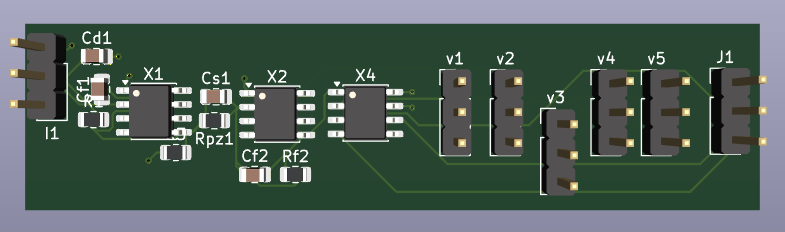
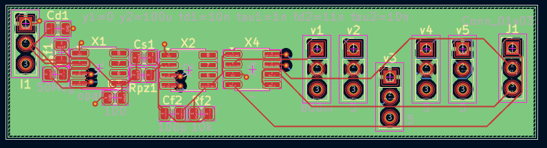

# OpenDAQ-AFE: Mixed-Signal Detector Readout & DAQ Pipeline

---

## 🔬 Project Overview

**OpenDAQ-AFE** is an open-source, production-grade mixed-signal data acquisition (DAQ) and detector front-end architecture. Designed for high-energy physics instrumentation, this system bridges microscopic sensor physics to real-time digital signal processing.

It takes a sub-nanosecond, femtocoulomb-level current pulse generated by a particle hit on a semiconductor sensor, processes it through an ultra-low noise analog front-end (AFE), and digitizes the signal via a high-speed path. 

---

## 📐 System Architecture & Signal Chain

    [ Semiconductor Sensor (PIN Diode / 70pF) ]
                           │ 
                           ▼ (1 pC Charge Pulse, ~1ns rise)
    [ Analog Front-End (OPA656 Charge-Sensitive Preamplifier) ]
                           │ 
                           ▼ (-900mV Step, 50us Exponential Decay)
    [ Active CR-RC Pulse Shaper with PZ Cancellation ]
                           │ 
                           ▼ (~720mV Semi-Gaussian shaping peak)
    [ High-Speed Flash ADC & FPGA RTL Engine ]
                           │ 
                           ▼ (Digitized Event Frames)
    [ CERN ROOT / Python Analysis Pipeline ]

---

## 🛠️ Repository Structure

    OpenDAQ-MixedSignal-AFE/
    ├── hardware_kicad/         # 4-Layer PCB schematics, layout (.kicad_pcb), and Gerbers
    ├── simulations_spice/      # Ngspice netlists, subcircuits (.sub), and transient analysis
    │   └── CSP_FrontEnd_Simulation/
    │       ├── opa656.sub      
    │       └── README.md       # Detailed SPICE math and slew-rate bottleneck logs
    ├── results/                # Visual proof and exported documentation
    │   ├── 01_simulations/     # Python-plotted transient response graphs
    │   ├── 02_schematics/      # PDF exports of system architecture
    │   └── 03_pcb_layout/      # 2D routing and 3D board renders
    └── README.md               # Main project overview (You are here)

---

## ⚡ Sub-System 1: Analog Front-End (CSP & Shaper)

### Mathematical Foundation
The Charge-Sensitive Preamplifier (CSP) converts input charge ($Q_{in}$) into a proportional voltage step via feedback capacitance ($C_f = 1\text{ pF}$). To prevent pulse pile-up at high event rates, the 50µs CSP decay tail is compressed using an active shaping amplifier. A Pole-Zero (PZ) cancellation network perfectly counteracts the CSP's discharge time constant.

* **Active Element:** OPA656 Wideband Unity-Gain Stable JFET-Input Op-Amp
* **Detector Capacitance:** 70 pF (PIN Photodiode emulation)
* **PZ Cancellation Resistor:** $R_{pz} = 500\text{ k}\Omega$ 

> *Above: Ngspice transient analysis displaying the shaper compressing the 50µs tail into a clean ~720mV semi-Gaussian peak, triggering the 3-bit Flash ADC logic (111).*
> *Note: For a deep dive into the SPICE slew-rate limitations and behavioral modeling of the ADC, [read the Simulation Notes here](simulations_spice/Simulation_README.md).*

---

## 🖨️ Sub-System 2: Physical Hardware (4-Layer PCB)

To translate the physics into silicon, the AFE was routed onto a strictly constrained, tapeout-ready physical board.

* **Dimensions:** Ultra-compact 16.7mm x 66.5mm footprint.
* **Stackup:** 4-Layer FR-4 (Signal, Ground Plane, Power Plane, Signal) for maximum EMI shielding.
* **Mixed-Signal Isolation:** Strict physical separation between the sensitive analog RF ground planes and the high-speed digital ADC return paths to protect the microvolt-level bias currents.

### Board Renders & Routing

  
  

---

## 📜 License
This hardware design and its associated software simulations are licensed under the **CERN Open Hardware Licence v2.0 - Strongly Reciprocal (CERN-OHL-S)**. See the LICENSE file for details.
