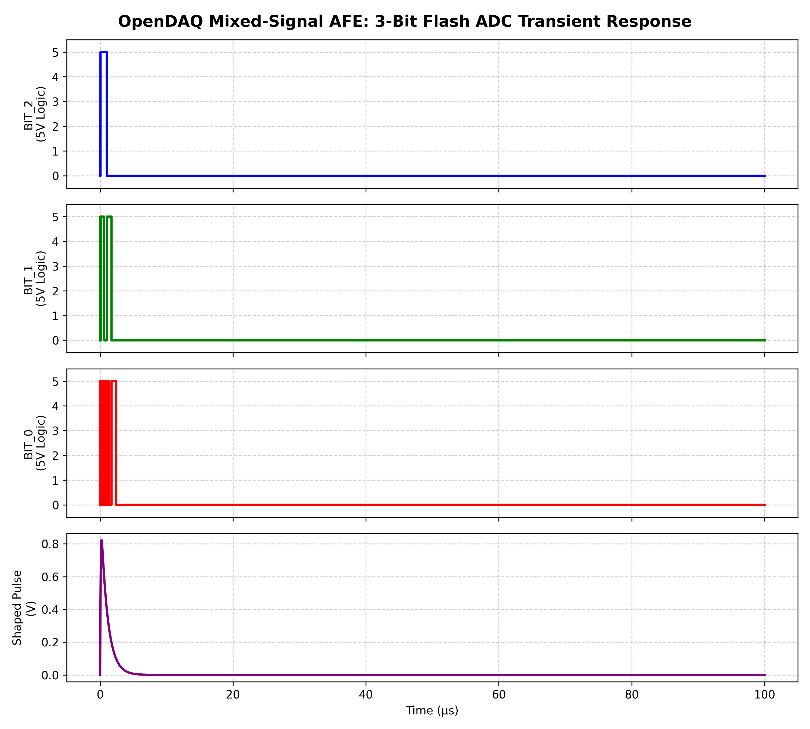

## 1. Charge-Sensitive Preamplifier (CSP) Front-End

### Objective
Design an ultra-low bias current analog front-end to integrate a 1 pC fast current pulse (simulating a particle strike on a 70 pF PIN photodiode) into a measurable voltage step.

### Architecture & Math
* **Op-Amp:** OPA656 (JFET input selected for low current noise).
* **Gain Stage:** Feedback capacitor $C_f = 1\text{ pF}$ designed to yield a step voltage of -1V for a 1 pC input charge.
* **Discharge Path:** Feedback resistor $R_f = 50\text{ M}\Omega$ placed in parallel to prevent saturation, setting a continuous discharge time constant of $\tau = 50\ \mu\text{s}$.

### Analysis
Transient analysis confirms the theoretical derivations. The initial charge injection drives the output to approximately -900 mV. At 50 µs, the signal decays to -330 mV, perfectly aligning with the theoretical $e^{-1}$ discharge curve.

---

## 2. Mixed-Signal Verification: 3-Bit Flash ADC

### Simulation Objective
* **Goal:** Validate the transient response of a 3-bit Flash ADC designed for the OpenDAQ Analog Front-End.
* **Input Signal:** A baseline-restored, 720 mV semi-Gaussian particle pulse peaking in roughly 1 to 2 microseconds.
* **Architecture:** An 8-resistor reference ladder (0V to 800mV) feeding 7 parallel comparators and custom digital logic bridges.

### Bottleneck 1: Component Slew Rate Limits
* **The Problem:** Initial simulations utilizing legacy LM741 op-amps resulted in a dead 0V digital output.
* **The Root Cause:** The LM741 possesses a slew rate of just 0.5V/µs. Swinging its output to trigger digital logic thresholds required upwards of 30 microseconds.
* **The Analysis:** The fast sub-microsecond particle pulse peaked and vanished long before the analog comparators could physically react.

### Bottleneck 2: Open-Loop Macro-Model Failure
* **The Problem:** Upgrading the comparators to the high-speed OPA656 (290V/µs slew rate) still yielded flatline results.
* **The Root Cause:** Vendor SPICE macro-models are mathematically optimized for closed-loop linear amplification. Forcing seven complex macro-models into an open-loop comparator topology caused internal saturation and engine convergence failures.

### The Solution: Behavioral Modeling & Visualization
* **Simulation Fix:** Replaced physical IC macro-models with mathematical arbitrary behavioral sources (`B` sources) acting as ideal comparators. This successfully decoupled the analog SPICE convergence constraints from the digital logic validation.
* **Data Extraction:** KiCad's native plotter struggled to auto-scale instantaneous 0V to 5V logic transitions. Raw transient data was exported via CSV and processed through a custom Python script (Pandas/Matplotlib) to generate a stacked, publication-ready visualization.

### Final Transient Response

*(Image: OpenDAQ AFE digitizing a 1 pC equivalent simulated particle hit)*
